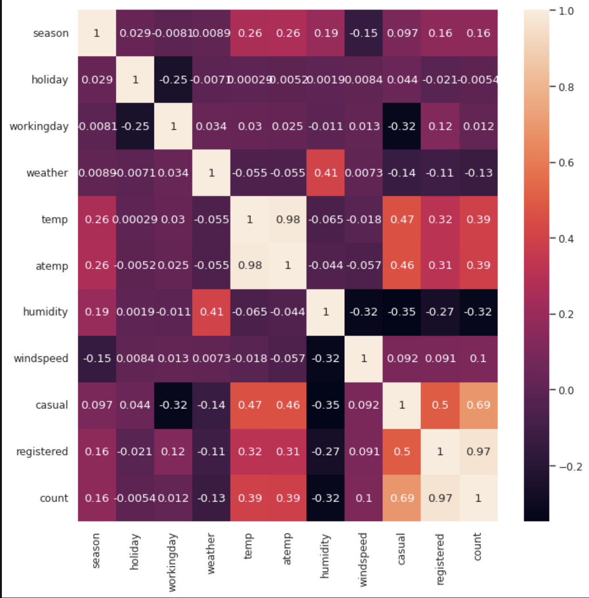
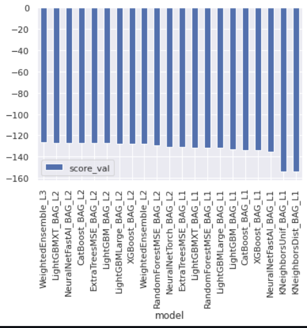
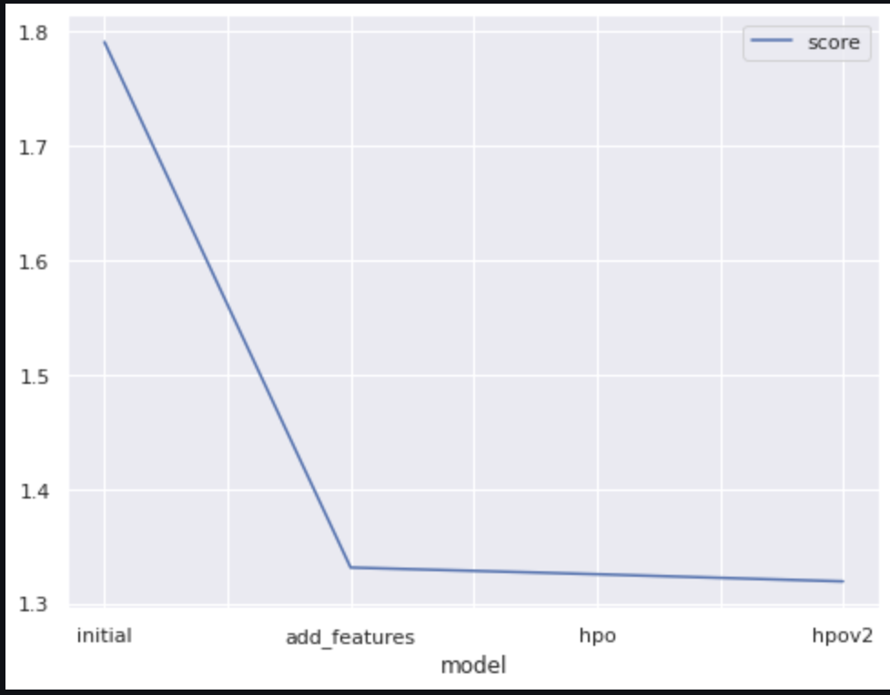

# PROJECT- Predict Bike Sharing Demand with AutoGluon
## Overview
    Bike sharing systems are a means of renting bicycles where the process of obtaining membership, rental, and bike return is automated via a network of kiosk locations
    throughout a city. Using these systems, people are able rent a bike from a one location and return it to a different place on an as-needed basis. Currently, there are
    over 500 bike-sharing programs around the world. The data generated by these systems makes them attractive for researchers because the duration of travel, departure
    location, arrival location, and time elapsed is explicitly recorded. Bike sharing systems therefore function as a sensor network, which can be used for studying mobility
    in a city. In this competition, participants are asked to combine historical usage patterns with weather data in order to forecast bike rental demand in the Capital
    Bikeshare program in Washington, D.C.
    
## Dataset

    1. datetime - hourly date + timestamp  
    2. season -  1 = spring, 2 = summer, 3 = fall, 4 = winter 
    3. holiday - whether the day is considered a holiday
    4. workingday - whether the day is neither a weekend nor holiday
    5. weather -
            1: Clear, Few clouds, Partly cloudy, Partly cloudy
            2: Mist + Cloudy, Mist + Broken clouds, Mist + Few clouds, Mist
            3: Light Snow, Light Rain + Thunderstorm + Scattered clouds, Light Rain + Scattered clouds
            4: Heavy Rain + Ice Pallets + Thunderstorm + Mist, Snow + Fog 

    6. temp - temperature in Celsius
    7. atemp - "feels like" temperature in Celsius
    8. humidity - relative humidity
    9. windspeed - wind speed
    10. casual - number of non-registered user rentals initiated
    11. registered - number of registered user rentals initiated
    12. count - number of total rentals

## Initial model using TabularPredictor

1. We trained an initial model with Autogluon TabularPredictor, ignored the columns "casual" and "registered" as they are not part of Test dataset as well. 
2. Preset selected for model choice is "best_quality", this preset provide best predictive accuracy with little consideration to inference time or disk usage. 
3. TIme_Limit parameter value is set to 600 seconds is the time given to a particular model to train.

4. WeightedEnseble scored topped the initial model leaderboard.
5. After submitting the initial model, we got a score of 1.79095 

## Exploratory Data Analysis

### Train dataset description

### Train dataset correlation matrix

### Train dataset correlation heatmap

### Train dataset pairplot

    1. Training dataset has 10,886 rows of data and 12 features
    2. Mean temp and temp values are 20.2 Celsius and 23.6 Celsius respectively
    3. Temp varies between 0-40 Celsius
    4. Mean relative humidity is 61 and valor between 0-100
    5. Mean windspeed is 12.7 and varies between 0 to 56.9
    6. All the features have no null values
    7. There are four unique values representing seasons for the season feature. We will convert this to category type as that is a better representation of that feature.
    8. There are four unique values representing weather feature. We will convert this to category type as that is a better representation of that feature.
    9. Holiday and Workingday have binary values. We will convert both of these features to boolean type.
    10. Based on pair plot, Registered bikes are rented more and are highly correlated.
    11. In medium Temperature, and humidiy bikes are rented more rather than when it’s too hot or cold or too humid.
    

## Data Preprocessing and New Features

    1. Based on EDA for festures "season" and "weather", we found that they have 4 unique values.
    2. We converted the type for these 2 features as category instead of int, so that same can be indicaed to the model
    3. Holiday and WOrkingday features also have 2 unique values each (0 and 1), since these are binary values, we converted these feature types to boolean.
    4. We created new features in train and test dataset-  day, date and year from datetime column.
    5. Since the new features were derived from datetime column, we dropped that feature from train and test dataset.

## Retrain model with new features

    1. We trained next model with new features (day, month, year) with Autogluon TabularPredictor, ignored the columns "casual" and "registered" as they are not part of Test dataset as well. 
    2. Preset selected for model choice is "best_quality", this preset provide best predictive accuracy with little consideration to inference time or disk usage. 
    3. TIme_Limit parameter value is set to 600 seconds is the time given to a particular model to train.

    4. WeightedEnseble still scored topped the model leaderboard with new features as well.
    5. After submitting the initial model, we got a score of 1.33117 
      

## Retrain model with hyperparameters (num_bag_folds=5, num_bag_sets=1, num_stack_levels=1)

    1. We trained next model with new features (day, month, year) with Autogluon TabularPredictor, ignored the columns "casual" and "registered" as they are not part of Test dataset as well. 
    2. Preset selected for model choice is "best_quality", this preset provide best predictive accuracy with little consideration to inference time or disk usage. 
    3. TIme_Limit parameter value is set to 600 seconds is the time given to a particular model to train.
    4. Hyperparameters selected num_bag_folds=5, num_bag_sets=1, num_stack_levels=1

    4. WeightedEnseble still scored topped the model leaderboard with new features as well.
    5. After submitting the initial model, we got a score of 1.32531 
    

## Retrain model with hyperparameters (num_bag_folds=10, num_bag_sets=2, num_stack_levels=2)

    1. For the second iteration with hyperparameters, following params were changed:
        
        num_bag_folds(10)= Number of folds used for bagging of models, to avoid overfitting, keeping the value to 10
        num_bag_sets(2)= Number of repeats of kfold bagging to perform. Total number of models trained during bagging = num_bag_folds * num_bag_sets. 
        num_stack_levels (2)= Number of stacking levels to use in stack ensemble. Roughly increases model training time by factor of num_stack_levels+1
        
        
## Model Score visualization

### model-score-table

### model-score-visualization

    1. WeightedEnsemble_L3 model is on top in the model leaderboard for all three runs.
    2. Model score improved after adding new features (month, day, year) derived from datetime.
    3. Hyperparameters tuning only improved the score slightly.